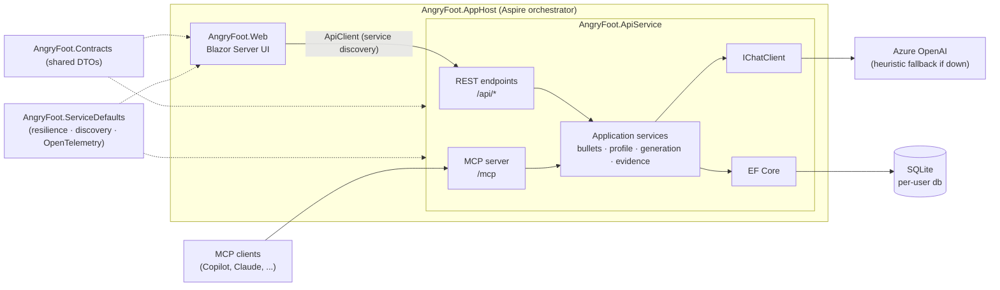

# AngryFoot

Helps a job candidate generate a bespoke resume for a target job description by storing achievement bullets, enriching them with AI metadata, analyzing the target job description, and generating a tailored resume + cover letter in Markdown.

## What it does

Jobs practically require customized resumes to even be seen because of the prescreening for relevant skills.  AngryFoot both generates a resume from a job description (and the user's entered 'Bullets') and provides guidance on creating additional bullets to strengthen their application.  It also enhances/provides guidance on enhancing bullets written by the user if desired.


## Architecture

AngryFoot is a .NET Aspire solution with two runnable services and three supporting projects:

- **AngryFoot.AppHost** — Aspire orchestrator. Launches the API service and web frontend, wires up service discovery, and hosts the developer dashboard.
- **AngryFoot.Web** — Blazor Server UI (Bullets, Profile, Generate, History pages). Talks to the API service exclusively through a typed `ApiClient` (`HttpClient` resolved via Aspire service discovery, `https+http://apiservice`). Renders generated Markdown with a Preview/Markdown toggle (Markdig).
- **AngryFoot.ApiService** — ASP.NET Core Minimal API hosting two front doors over the same application services: REST endpoints (`/api/bullets`, `/api/profile`, `/api/generations`, `/api/artifacts`, `/api/ai/status`) and an MCP server (`/mcp`, streamable HTTP) exposing bullet CRUD as tools for AI agents like Copilot. Application services handle bullet enrichment (AI tagging), job analysis, evidence coverage analysis, bullet ranking/rewriting, and resume/cover-letter assembly. Every AI-backed service calls Azure OpenAI through the provider-agnostic `IChatClient` abstraction and degrades to deterministic heuristics when AI is unavailable. Bullet selection for a generation prefers semantic retrieval — bullets are embedded and indexed in Qdrant, and the job description is matched against them by vector similarity — falling back to the original deterministic keyword-overlap ranking when no embedding deployment is configured (see [Semantic bullet retrieval (RAG)](#semantic-bullet-retrieval-rag)). Persistence is EF Core over a per-user SQLite database.
- **AngryFoot.Contracts** — shared DTOs referenced by both Web and ApiService, so the UI and API can never drift apart silently.
- **AngryFoot.ServiceDefaults** — shared Aspire plumbing: HTTP resilience (retry/circuit-breaker), service discovery, and OpenTelemetry tracing/metrics for both services.
- **AngryFoot.Tests** — xUnit suite: fast Moq-based unit tests for every service, plus Aspire integration tests that boot the full AppHost against isolated temp databases (including an end-to-end MCP client test).



The generation pipeline inside the API service runs as a chain: job description → `HeuristicJobAnalyzer` (extract requirements) → `EvidenceCoverageService` (link each requirement to the bullets that evidence it) → retrieve candidate bullets (semantic search via `BulletRetrievalService`/Qdrant when configured, otherwise `BulletRankingService`'s keyword-overlap scan of the full library) → `BulletRewriteService` (tailor them to the job) → `ResumeMarkdownService` + `CoverLetterService` (assemble Markdown) → persisted as a `GenerationArtifact` (browsable on the History page).

## Tech stack

- **Languages:** C# (.NET 10), Razor
- **Frameworks/libraries:** ASP.NET Core Minimal APIs, Blazor Server, .NET Aspire 13.4 (orchestration, service discovery, dashboard), Entity Framework Core 10 + SQLite, Microsoft.Extensions.AI (`IChatClient` and `IEmbeddingGenerator` abstractions), Qdrant.Client + Aspire.Hosting.Qdrant/Aspire.Qdrant.Client (optional semantic retrieval), ModelContextProtocol C# SDK (MCP server + client), Serilog (rolling file logs), Markdig (Markdown rendering), Bootstrap 5. Tests: xUnit v3, Moq, AwesomeAssertions, Aspire.Hosting.Testing.
- **AI models/services:** Azure OpenAI chat completions (default deployment `gpt-5-mini`) for bullet enrichment, job analysis, evidence review, bullet rewriting, and cover-letter drafting. Optionally, an Azure OpenAI embedding deployment + Qdrant for semantic bullet retrieval. Every AI feature has a deterministic heuristic fallback, so the app remains fully functional with no AI (and no Qdrant) configured.
- **Hosting:** Local-first. The Aspire AppHost runs both services on Kestrel with dynamically assigned ports, plus a Docker-hosted Qdrant container it starts and stops automatically for semantic bullet retrieval. No cloud deployment required. Data lives in a per-user SQLite database; Qdrant's vector data is bind-mounted to a local folder next to it. Set `Qdrant:Enabled=false` to skip the container entirely (see Configuration).

## Getting started

### Prerequisites

- **.NET 10 SDK** (the repo builds with a 10.0.4xx preview SDK; Aspire 13.4 is pulled in via the AppHost project SDK — no separate workload install needed)
- **Docker** (running). The AppHost automatically starts a Qdrant container (`qdrant/qdrant:latest`) on `dotnet run` for semantic bullet retrieval. Without Docker running, set `Qdrant:Enabled=false` (see Configuration) — the app then runs exactly as before, with keyword-overlap ranking and no Qdrant.
- **Azure OpenAI resource with a chat deployment** (optional). Without it the app runs entirely on heuristic fallbacks; with it you get full AI enrichment, evidence review, and generation. You will need three values: the resource endpoint URL (`https://<resource>.openai.azure.com`), an API key, and the chat deployment name.
- No external database server — SQLite is embedded and created on first run; Qdrant's data is a local Docker bind mount, not a separate service to provision.

### Setup

```bash
# Clone the repo
git clone <repository-url>
cd <repository-directory>

#Configure Azure OpenAI via user secrets - see Configuration below
dotnet user-secrets set "AzureOpenAI:Endpoint" "https://<resource>.openai.azure.com/openai/v1" --project AngryFoot.AppHost
dotnet user-secrets set "AzureOpenAI:ApiKey" "<your-api-key>" --project AngryFoot.AppHost
 (Optional): dotnet user-secrets set "AzureOpenAI:ChatDeployment" "gpt-5-mini" --project AngryFoot.AppHost
 Defaults to gpt-5-mini if not set.  If you have multiple deployments, you can set this to the one you want to use for chat completions.
# Run everything (API + Web + Aspire dashboard)
dotnet run --project AngryFoot.AppHost

# Run the test suite
dotnet test
```

The Aspire dashboard URL is printed on startup; it lists the live endpoints for the web frontend and API service (ports are assigned dynamically).

### Configuration

Secrets are stored with **.NET user secrets** (never committed; there is no `.env` file). All settings are read from standard .NET configuration, so environment variables work too (replace `:` with `__`, e.g. `AzureOpenAI__ApiKey`).

| Setting | Shape | Purpose |
|---|---|---|
| `AzureOpenAI:Endpoint` | `https://<resource>.openai.azure.com` | Azure OpenAI resource URL. If a full deployment path is pasted, the deployment name is extracted automatically. |
| `AzureOpenAI:ApiKey` (or `AzureOpenAI:Key`) | opaque key string | Azure OpenAI API key |
| `AzureOpenAI:ChatDeployment` (or `Deployment` / `Model`) | deployment name, e.g. `gpt-5-mini` | Chat deployment to use; defaults to `gpt-5-mini` |
| `AzureOpenAI:ServiceVersion` | e.g. `V2024_10_21` | Optional Azure OpenAI API version pin |
| `AzureOpenAI:EmbeddingDeployment` | deployment name | Not a secret — defaults to `text-embedding-3-small` in `AngryFoot.AppHost/appsettings.json` (checked in). Enables semantic bullet retrieval once the endpoint/key are also set (Qdrant runs regardless; without this the API service still falls back to keyword ranking). Override in that file, or via user-secrets/env var, if your Foundry deployment is named differently. |
| `AzureOpenAI:EmbeddingDimensions` | integer | Optional. Vector size for the embedding model; defaults to `1536` (matches `text-embedding-3-small`/`text-embedding-ada-002`). |
| `Qdrant:Enabled` | `true`/`false` | AppHost-only, set in `AngryFoot.AppHost/appsettings.json` (defaults to `true`): Aspire automatically starts the latest Qdrant container (Docker required) and wires it to the API service. Flip to `false` in that file — or override per-environment via user-secrets/env var — to skip it, e.g. without Docker. `dotnet test` always disables it for its integration tests, regardless of this setting. |
| `ConnectionStrings:angryfoot` | `Data Source=<path>` | Optional SQLite override. Default: `%LOCALAPPDATA%\AngryFoot\angryfoot.db` (per-user, survives rebuilds; integration tests point this at isolated temp files) |

If AI is not configured, `GET /api/ai/status` reports Unhealthy with setup instructions, and all AI features fall back to heuristics; the same response's `retrievalEnabled`/`retrievalMessage` fields report whether semantic bullet retrieval is active. Both services write rolling log files to their own `Logs/` directory in addition to the console. The MCP endpoint is served at `http://localhost:<apiservice-port>/mcp` (streamable HTTP; find the port on the Aspire dashboard).

### Schema-enforced AI responses

Every AI call that expects JSON sends a JSON Schema derived from the C# type it will be parsed into (`ChatResponseFormat.ForJsonSchema<T>`, via `GetJsonResponseAsync<T>` in [`AiChatClientExtensions.cs`](AngryFoot.ApiService/Ai/AiChatClientExtensions.cs)), so the model is *constrained* to the shape rather than asked for it in the prompt and checked afterwards.

This was not a theoretical concern. The enrichment step used to lose whole responses to shape drift — the model would answer a bullet about batch runtime with

```json
"impact": [ { "originalRuntime": "6 hours", "newRuntime": "40 minutes", "percentReduction": 88.9 } ]
```

against a contract of `IReadOnlyList<string>`. The JSON was valid; only the shape disagreed, and because the parse is all-or-nothing the perfectly good `skills`, `technologies`, and `tags` in the same response went in the bin with it.

Three things this deliberately does **not** do:

- **It does not guarantee truth.** A schema constrains shape, not meaning. The refinement stages still check that every returned `bulletId` belongs to the candidate, because nothing stops a well-formed answer from citing a bullet that does not exist.
- **It does not replace the tolerant parser.** `AiJsonUtilities` still extracts JSON from prose and code fences, because a schema only helps if the provider honours it.
- **It does not apply to the cover letter**, which asks for markdown prose and has no shape to enforce.

Support depends on the deployment and the pinned `AzureOpenAI:ServiceVersion`. If a deployment rejects the schema the call is retried without it and a warning is logged naming the payload type — the feature keeps working, but the guarantee is gone, so that warning is worth watching for. Types that cannot be expressed in a closed schema (an unbounded `Dictionary<string, object>`, a bare `object`, or a root that is not an object) are logged and sent unconstrained; this is why the bullet rewrite draft wraps its array in a `{ "bullets": [...] }` envelope.

### Semantic bullet retrieval (RAG)

Picking bullets for a generation prefers semantic retrieval over the original deterministic keyword overlap (`BulletRankingService`): each bullet is embedded and indexed in Qdrant, so a generation retrieves only the bullets that are actually relevant to the job description by vector similarity — this scales better as your bullet library grows and finds matches keyword overlap misses (e.g. "led cloud migration" matching a JD asking for "cloud transformation experience").

Qdrant itself (`qdrant/qdrant:latest`) starts automatically with `dotnet run --project AngryFoot.AppHost` — Aspire launches it as a Docker container and persists its data in `%LOCALAPPDATA%\AngryFoot\qdrant` (a local bind mount, not an opaque Docker volume), next to `angryfoot.db`. It still needs an embedding deployment to actually be used, and — unlike the endpoint/API key — the deployment name isn't a secret, so it's a checked-in default in [`AngryFoot.AppHost/appsettings.json`](AngryFoot.AppHost/appsettings.json):

```json
{
  "AzureOpenAI": {
    "EmbeddingDeployment": "text-embedding-3-small"
  }
}
```

So once you've deployed a `text-embedding-3-small` model in Azure AI Foundry on the **same resource** as your chat deployment (same `AzureOpenAI:Endpoint`/`ApiKey`), it's picked up automatically — no extra config needed. If you named the deployment something else, or deployed a different model (e.g. `text-embedding-3-large`, which needs `AzureOpenAI:EmbeddingDimensions` set to `3072` since it doesn't share `text-embedding-3-small`'s 1536-dim vectors), override the value above directly in that file, or via `dotnet user-secrets set "AzureOpenAI:EmbeddingDeployment" "<your-deployment-name>" --project AngryFoot.AppHost` for a machine-local override that doesn't touch the checked-in default.

Without a usable embedding deployment, Qdrant still starts (it's harmless and idle) but the API service falls back to keyword-overlap ranking, exactly as before this feature existed. If Docker isn't available, flip `Qdrant.Enabled` to `false` in the same file — no code change needed:

```json
{
  "Qdrant": {
    "Enabled": false
  }
}
```

`dotnet test`'s Aspire integration tests always disable Qdrant for themselves regardless of this setting, so running the test suite never requires Docker.

### Evidence coverage

**Analyze** answers one question: how much of what this posting asks for do your bullets actually evidence? Every part of the answer is traceable back to a bullet you wrote.

**The score is derived, not asserted.** It is always

```
coverageScore = round(100 × earnedWeight / totalWeight)
```

and both operands ship on the response. Each requirement is worth `weight × 2` points and earns `weight ×` 2 for strong evidence, 1 for weak, 0 for none — so you can recompute the number by hand from the rows on screen. Required skills and named technologies weigh 2; preferred skills weigh 1.

**Strong, weak, or missing** is decided by what the bullet says:

| | |
|---|---|
| **Strong** | the requirement is one of the bullet's extracted skills or technologies, **or** the bullet names it *and* quantifies a result |
| **Weak** | a bullet mentions it but never shows what came of the work — half credit |
| **Missing** | no bullet mentions it |

**Diagnostics** read like editor diagnostics rather than a grade, at three severities — `warning`, `suggestion`, `info` — covering missing requirements, weak evidence, near-duplicate bullets, bullet ordering, overused wording, bullets with no measurable impact, unsupported claims, and the limits of the analysis itself. Every diagnostic and every requirement carries a **Why**: the requirement at stake, the bullets cited for it, what evidence is absent, and the reasoning connecting them. There is no recommendation anywhere in the product that does not come with one.

**What the AI is and is not allowed to do.** With no AI configured the report is complete — word matching, the strength rule, and all six deterministic analyzers run, and the report says `source: Deterministic` so you know a paraphrase may have been missed. With AI configured, a reviewer may correct what word matching got wrong, but it **never returns a score**. It may lower a strength freely; it may raise one by at most a single step, only while citing a bullet it was actually given, and never to *strong* on a bullet that does not name the requirement. A bullet it cites by meaning rather than by words is shown as **AI-identified**, with the bullet's real text beside it. The worst a hallucinated match can do is move one requirement half a step — and you can see it and overrule it.

**On the wording.** This measures a document. A low number means your bullets do not yet *say* something, not that you have not *done* it — and the UI says so directly, under the score, every time. The number is deliberately rendered without a red/amber/green treatment for the same reason; colour is spent on the per-requirement rows, where it points at something you can act on.

**Generate** produces its own report over the bullets that made the resume, in the order the resume prints them — which is what lets it flag a stronger bullet sitting below a weaker one. It is stored with the artifact and frozen, so reopening a generation from History explains the resume you actually sent rather than re-scoring it against a library that has moved on since.

### Bullet versions and bullet quality

A rewrite is a suggestion until the person who did the work says otherwise, so AngryFoot keeps rewrites **beside** a bullet rather than on top of it. Writing a version never changes your bullet; only **Use this version** does, and the wording it replaces survives as that version's source text.

Each version is written for a particular audience, and a bullet can hold several at once:

| Mode | What it does |
|---|---|
| **Grammar cleanup** | Fixes grammar, tense, and punctuation. Changes nothing else. |
| **Stronger wording** | Same facts, sharper verbs, less filler, accomplishment before context. |
| **STAR format** | Situation, task, action, result. Parts your bullet does not supply are left out rather than invented. |
| **Executive** | Leads with outcome, scope, and ownership; drops detail a non-engineer skips. |
| **Technical** | Foregrounds the systems, techniques, and the engineering decision. |
| **ATS** | Plain wording and standard industry terms for keyword screens; spells out abbreviations. |

Every mode carries the same rule into its prompt: a version may change how an accomplishment is told and never what it claims. A rewrite that invents a metric is worse than no rewrite, because you are the one who has to defend it in the room.

Versions are numbered per mode, so "the ATS version" has a history rather than a single current value. A version whose source wording you have since edited is marked **Out of date** rather than quietly presenting itself as current.

**Bullet quality** scores how a bullet is written, independently of any posting, and — like evidence coverage — the number is the sum of the signals shown beneath it and nothing else:

| Signal | Points | What it reads |
|---|---|---|
| Opens with an action | 20 | The first word |
| Measurable result | 30 | A figure anywhere in the bullet |
| Sole credit | 5 | Wording that gives credit away |
| Names specifics | 20 | A proper noun |
| Names technology | 15 | The text, or the enrichment tags |
| Maps to a role | 10 | The enrichment tags |

Every signal reports **what it saw**, not just whether it passed — `States "40%"`, `Opens with "Responsible for"`, `Shared credit: "we"`. A verdict without the words behind it can't be checked, and an assessment that can't be argued with gets argued with anyway.

**Sole credit is worth 5 points, and presumes you.** A resume elides its subject by convention: every bullet is read as your own work unless it says otherwise. So the check does not hunt for proof of ownership — nothing short of writing "I" would qualify, and demanding that would reject "Mentored two interns", "Developed the wrappers", and most of what anyone writes. It looks only for wording that gives credit *away*: `we`, `our team`, `assisted with`, `contributed to`, `participated in`. Possessives are deliberately not on that list — "the software team's first CI/CD server" says whose server it was, not who built it.

It is also the only signal you can **settle** yourself. Whether work was shared is a fact no wording can establish, so if the check reads your bullet wrong, mark it settled: it scores, it reports as *Declared* rather than pretending the text proved it, and it stops being raised. Nothing else is settleable — whether a figure is present is not a matter of opinion.

Length is advice, not a penalty: a bullet past roughly forty words gets a note, but keeps its points, because a long bullet full of evidence beats a short empty one. "Maps to a role" asks only whether enrichment could place the work in any job family at all — whether it suits *your* target posting is [evidence coverage](#evidence-coverage)'s question, and answering it twice in two ways would leave you with two numbers to reconcile.

**Reassess** scores the wording in the box without saving it. Two of the six signals come from enrichment rather than the text, so a full score costs an AI call; running it on demand means you can see the score before committing to the wording, and the enrichment is kept so the save that follows does not pay for it twice.

Versions are scored against their parent bullet's enrichment, since a reworded accomplishment involves the same technologies whatever words it uses.

Without AI configured, writing a version tidies the text and tells you what that mode would have done — it does not attempt the rewrite, because a heuristic cannot restructure a bullet into STAR without inventing the parts that are missing.

### Occupational benchmark

Alongside evidence coverage — which measures how well your bullets evidence *the posting you pasted in* — **Analyze** also reports how your library compares against the requirements that are typical of the *occupation* as a whole. A posting can omit skills that are near-universal for the role, and that gap is invisible to a posting-only assessment.

The comparison set is aggregate labor-market data from the [O\*NET occupational database](https://www.onetonline.org) (U.S. Department of Labor/ETA), bundled at [`AngryFoot.ApiService/Application/Benchmarks/Data/onet-occupations.json`](AngryFoot.ApiService/Application/Benchmarks/Data/onet-occupations.json). No configuration, API key, or network access is required — it works offline on first run.

**This is deliberately occupation-level and never individual-level.** The feature compares your bullets against published statistics about an occupation. It does not — and by design will not — scrape, collect, aggregate, or display data attributable to any real person, any specific employer, or that employer's actual employees. See [issue #5](https://github.com/IsaacSherman/Vslhq26-angry-foot-/issues/5) for the reasoning.

How it works:

- The **Job Title** field on `/generate` is mapped to an O\*NET occupation by exact match against the occupation's title and its published reported job titles, then by word-overlap for a fuzzy match. Seniority and ladder markers (`Senior`, `Staff`, `II`) are stripped first, since O\*NET occupations are not ladder-specific. If no title is entered, the title inferred from the job description is used.
- Each requirement in the occupation's profile is checked against your bullets using the same evidence rule as [evidence coverage](#evidence-coverage) (`BulletEvidence`), weighted by O\*NET's published importance rating.
- No mapping is reported rather than guessed: an unrecognized title gets an explanatory message, not a wrong occupation.

To refresh the snapshot from O\*NET, run the two scripts in [`tools/onet/`](tools/onet/) — `extract_onet.py` then `build_dataset.py` — and copy the regenerated `onet-occupations.json` over the bundled copy. Their comments document every transformation applied to the published data, and `onet-occupations.json` carries a `notes` block recording which values are O\*NET's and which are ours.

### Deep review (critique-and-revise)

By default every AI-backed feature returns its **first** draft. **Deep review** is an opt-in checkbox on `/bullets/edit` and `/generate` that puts that draft through three more agents before you see it, and then hands you the versions to choose between rather than picking for you.

| Label | Agent | What it is |
|---|---|---|
| `v1` | the writer | the first draft — exactly what you get with deep review off |
| `v2` | the reviewer | critiques `v1`, then writes its own alternative from scratch |
| `v1a` | the writer | revises `v1` after reading **only the critique**, never the reviewer's alternative |
| `synthesis` | the arbiter | merges the versions into one, and is what's recommended by default |

The reviewer and the arbiter both get grounding from your bullet library, so "you didn't do that" is a claim they can actually make. Retrieval uses Qdrant when it's configured and falls back to term overlap against SQLite otherwise, so deep review works without an embedding deployment.

The stages degrade independently: a failed reviewer abandons the pass and you keep `v1`, and a failed reviser or arbiter just drops that version. Deep review is skipped entirely whenever the draft came from a heuristic fallback rather than the AI — there is nothing to critique.

**On `/generate`,** deep review also rewrites the *shape* of the resume, not just its wording. The refinement stages may reorder your bullets (strongest evidence first), drop a weak one, and swap in a stronger bullet the ranker left on the bench — it's given runner-up candidates for exactly this. It cannot invent a bullet: every id it returns is checked against your library, and the set is capped at your Max Bullets. The initial draft still only rewords, in the ranker's order.

**Telling it what you meant.** The most common failure isn't bad prose, it's an agent confidently misreading an ambiguous bullet. Two places to correct it:

- **`/bullets/edit`** pauses after the critique and shows you `v1`, the critique, and `v2` with a comment box. Whatever you write is treated as fact by the remaining agents and **outranks the critique** — "'systems' here means HVAC controls, not software" stops the misreading before the revision and synthesis bake it in. Leave it blank and the pass carries on unguided.
- **`/generate`** takes the same clarification up front, in the **Guidance for the AI** box. It reaches every stage including the first draft, so it works with deep review off too.

The pause is entirely client-side: phase one hands its whole payload back and phase two takes it in, so the server never holds a half-finished rewrite.

**Cost and latency.** Deep review is three extra AI calls per refined artifact — and a generation refines two (the bullet set as a whole, then the cover letter), so it's six extra calls, not three per bullet. Measured against `gpt-5-mini`, 6 bullets in the library, Max Bullets 5:

| `POST /api/generations` | Plain | Deep review |
|---|---|---|
| AI calls | 3 | 9 |
| Wall clock | 27-34s | 122-141s (3.6-4.5×) |

Ranges are across repeat runs of the same request — the spread is the model's, not the pipeline's, so treat the upper end as the planning number. Budget **two to two and a half minutes** for a deep-review generation against a small library, growing with bullet count and job-description length.

Version counts vary run to run for the same reason. A stage whose reply cannot be read back is dropped rather than shown as a broken choice, so a deep review may offer three versions instead of four; the raw response is logged when that happens. The web client allows a 10 minute ceiling (`AttemptTimeout` in [`AngryFoot.Web/Program.cs`](AngryFoot.Web/Program.cs), mirrored for tests in [`TestResilience.cs`](AngryFoot.Tests/TestResilience.cs)); `DeepReviewGeneration_WithRealAi_WhenEnabled_FitsInsideItsTimeout` in [`RealAiSmokeTests.cs`](AngryFoot.Tests/RealAiSmokeTests.cs) fails if a change pushes past it. Run it with `RUN_AI_INTEGRATION=1` to re-measure on your own deployment.

The bullet editor is cheaper, and feels faster despite the extra calls, because the gate splits the wait: two calls, then your turn, then two more.

One rough edge worth knowing: the resume stages exchange a JSON array rather than prose, and models are less reliable at that. A version whose JSON doesn't parse back into a valid bullet set is dropped, so a deep-review generation sometimes offers three resume versions where the cover letter offers four. It degrades quietly and the remaining versions are unaffected.

## Demo

- Video file in this repo: `./demo/demo.mp4`

## Known limitations

- **MCP integration is not completely implemented.** The app only supports a single MCP service (`apiservice`) with no multi-service support or service discovery, and the MCP tools currently cover bullet management only — profile editing and resume generation are not yet exposed as tools.
- **Single user, no authentication.** The REST API and MCP endpoint are unauthenticated and the database holds exactly one profile, so the app is local-use only; anything that can reach the ports can read and write.
- **Markdown output only.** Generated resumes and cover letters are Markdown; there is no PDF or DOCX export yet, so final formatting happens in whatever tool you paste into.
- **Bullets map to employers by exact name match.** A bullet lands under a work-history entry only when its employer field matches the profile entry (case-insensitive); unassigned bullets fall into a generic "Selected Experience" section.
- **Generation is synchronous.** A full generation chains several AI calls inside one HTTP request (typically 30-90 seconds) with no progress streaming, background queue, or cancellation UI. Deep review roughly quadruples that — two to two and a half minutes — inside the same single request, which is why it is opt-in. The client allows up to 10 minutes before giving up, and there is no server-side per-call timeout on the generation path, so a stalled AI call holds the request open until that ceiling.
- **Evidence coverage only sees the bullet library.** It does not weigh work-history dates, education, or certifications, so requirements like "7+ years of experience" are not evaluated.
- **The occupational benchmark is a hand-refreshed snapshot of 21 U.S. technology occupations.** It does not update itself, covers technology and technology-adjacent roles only, and reflects the U.S. labor market; a title outside that set reports no match rather than a wrong one. Matching a bullet to a requirement is substring-based, so it credits the wrong bullet occasionally and misses paraphrases, and technology weightings are ours rather than O\*NET's (the dataset's `notes` block spells out exactly which values are which). Wage and employment context from BLS OEWS is not included.
- **AI output is not fact-checked.** Prompts forbid inventing metrics or technologies, and [deep review](#deep-review-critique-and-revise) adds a reviewing agent grounded in your bullet library that is specifically asked to catch unsupported claims — but that is still an AI checking an AI, not verification. Generated content should be reviewed before sending to a real employer.
- **Heuristic fallbacks are English- and .NET-centric.** The keyword lists behind offline tagging, job analysis, and ranking are tuned for English-language, Microsoft-stack roles; other domains degrade to weaker matches when AI is unavailable.
- **No pagination or rate limiting.** Bullet and history lists load everything at once, and AI-backed endpoints have no throttling, which is fine for a single local user but not for shared deployment.
- **No backfill/reindex job for semantic retrieval.** Bullets are only embedded going forward from whenever `AzureOpenAI:EmbeddingDeployment` is first configured (via `IBulletService`'s create/update/enrich paths), so bullets created before that point won't surface in semantic search until they're edited or re-enriched. Without an embedding deployment configured at all (Qdrant running or not), generation still keyword-scores the entire bullet library on every request, so cost/latency there still scale with library size.

## Open Source Software (FOSS) Attribution

AngryFoot is built on the following open-source packages. Versions and licenses reflect the package metadata shipped with each NuGet package (`dotnet list package` for the full transitive graph).

### Platform & SDKs

| Component | Version | License | Project |
|---|---|---|---|
| .NET / ASP.NET Core / Blazor | net10.0 | MIT | <https://github.com/dotnet> |
| Aspire (AppHost SDK, orchestration) | 13.4.6 | MIT | <https://github.com/microsoft/aspire> |
| Aspire.Hosting.Qdrant | 13.4.6 | MIT | Aspire container resource that runs Qdrant automatically (`Qdrant:Enabled=false` to disable) |

### Bundled data

| Dataset | Version | License | Purpose |
|---|---|---|---|
| [O\*NET Database](https://www.onetcenter.org/database.html) | 30.3 (retrieved 2026-08-11) | CC BY 4.0 | Aggregate occupational skill, knowledge, and technology profiles behind the occupational benchmark |

> This product uses information from O\*NET OnLine by the U.S. Department of Labor, Employment and Training Administration (USDOL/ETA), used under the [CC BY 4.0](https://creativecommons.org/licenses/by/4.0/) license. AngryFoot has modified the data by selecting a subset of occupations and descriptors. USDOL/ETA has not approved, endorsed, or tested these modifications. O\*NET® is a trademark of USDOL/ETA.

### API Service (`AngryFoot.ApiService`)

| Package | Version | License | Purpose |
|---|---|---|---|
| Azure.AI.OpenAI | 2.1.0 | MIT | Azure OpenAI client for chat completions |
| Microsoft.AspNetCore.OpenApi | 10.0.8 | MIT | OpenAPI document generation |
| Microsoft.EntityFrameworkCore.Sqlite | 10.0.8 | MIT | EF Core ORM with SQLite provider |
| Microsoft.EntityFrameworkCore.Design | 10.0.8 | MIT | EF Core migrations tooling (build-time) |
| Microsoft.Extensions.AI | 10.8.1 | MIT | Provider-agnostic `IChatClient`/`IEmbeddingGenerator` abstractions |
| Microsoft.Extensions.AI.OpenAI | 10.8.1 | MIT | OpenAI adapter for Microsoft.Extensions.AI |
| Microsoft.Extensions.Configuration.UserSecrets | 10.0.10 | MIT | Local secret storage for AI credentials |
| Microsoft.Extensions.Logging.Console | 10.0.10 | MIT | Console logging provider |
| ModelContextProtocol.AspNetCore | 2.0.0 | Apache-2.0 | MCP server over streamable HTTP (`/mcp`) |
| Qdrant.Client | 1.18.1 | Apache-2.0 | Vector database client for optional semantic bullet retrieval |
| Aspire.Qdrant.Client | 13.4.6 | MIT | Aspire client integration wiring `QdrantClient` via service discovery |
| Serilog.Extensions.Logging | 10.0.0 | Apache-2.0 | Serilog bridge for Microsoft.Extensions.Logging |
| Serilog.Sinks.File | 7.0.0 | Apache-2.0 | Rolling file logging to `./Logs/` |

### Web Frontend (`AngryFoot.Web`)

| Package | Version | License | Purpose |
|---|---|---|---|
| Markdig | 1.3.2 | BSD-2-Clause | Markdown-to-HTML rendering for resume/cover letter preview |
| Serilog.Extensions.Logging | 10.0.0 | Apache-2.0 | Serilog bridge for Microsoft.Extensions.Logging |
| Serilog.Sinks.File | 7.0.0 | Apache-2.0 | Rolling file logging to `./Logs/` |
| Bootstrap (vendored in `wwwroot/lib`) | 5.3.3 | MIT | CSS framework for the Blazor UI |

### Service Defaults (`AngryFoot.ServiceDefaults`)

| Package | Version | License | Purpose |
|---|---|---|---|
| Microsoft.Extensions.Http.Resilience | 10.6.0 | MIT | Standard HTTP retry/timeout/circuit-breaker policies |
| Microsoft.Extensions.ServiceDiscovery | 10.6.0 | MIT | Aspire service discovery (`https+http://apiservice`) |
| OpenTelemetry.Exporter.OpenTelemetryProtocol | 1.15.3 | Apache-2.0 | OTLP telemetry exporter |
| OpenTelemetry.Extensions.Hosting | 1.15.3 | Apache-2.0 | OpenTelemetry host integration |
| OpenTelemetry.Instrumentation.AspNetCore | 1.15.2 | Apache-2.0 | ASP.NET Core tracing/metrics |
| OpenTelemetry.Instrumentation.Http | 1.15.1 | Apache-2.0 | HttpClient tracing/metrics |
| OpenTelemetry.Instrumentation.Runtime | 1.15.1 | Apache-2.0 | .NET runtime metrics |

### Tests (`AngryFoot.Tests`)

| Package | Version | License | Purpose |
|---|---|---|---|
| Aspire.Hosting.Testing | 13.4.6 | MIT | Integration testing against the full AppHost |
| AwesomeAssertions | 9.5.0 | Apache-2.0 | Fluent assertion library |
| coverlet.collector | 6.0.2 | MIT | Code coverage collection |
| Microsoft.Extensions.AI | 10.8.1 | MIT | `IChatClient` abstractions for test fakes |
| Microsoft.NET.Test.Sdk | 17.14.1 | MIT | .NET test platform |
| ModelContextProtocol | 2.0.0 | Apache-2.0 | MCP client for end-to-end `/mcp` tests |
| Moq | 4.20.72 | BSD-3-Clause | Mocking framework |
| xunit.v3 | 3.0.1 | Apache-2.0 | Test framework |
| xunit.runner.visualstudio | 3.1.4 | Apache-2.0 | Visual Studio / `dotnet test` runner |

### Notable transitive components

| Component | License | Notes |
|---|---|---|
| Serilog (core) | Apache-2.0 | Pulled in by the Serilog packages above |
| SQLitePCLRaw / e_sqlite3 | Apache-2.0 | Native SQLite bindings used by EF Core |
| SQLite | Public Domain | The embedded database engine itself |
| Polly / Polly.Core | BSD-3-Clause | Resilience engine behind Microsoft.Extensions.Http.Resilience |
| OpenAI (official .NET library) | MIT | Underlying client used by Azure.AI.OpenAI |

All listed licenses (MIT, Apache-2.0, BSD-2-Clause, BSD-3-Clause, Public Domain) are permissive. If you redistribute this application, retain the copyright and license notices of these projects per their respective terms.

# Special Thanks
Special thanks to Ryan (https://github.com/RyCox), who helped me polish the idea that's been kicking around in my brain for years.
# License
This project is under the MIT license.  MIT License

Copyright (c) 2026 Isaac Ben Sherman

Permission is hereby granted, free of charge, to any person obtaining a copy
of this software and associated documentation files (the "Software"), to deal
in the Software without restriction, including without limitation the rights
to use, copy, modify, merge, publish, distribute, sublicense, and/or sell
copies of the Software, and to permit persons to whom the Software is
furnished to do so, subject to the following conditions:

The above copyright notice and this permission notice shall be included in all
copies or substantial portions of the Software.

THE SOFTWARE IS PROVIDED "AS IS", WITHOUT WARRANTY OF ANY KIND, EXPRESS OR
IMPLIED, INCLUDING BUT NOT LIMITED TO THE WARRANTIES OF MERCHANTABILITY,
FITNESS FOR A PARTICULAR PURPOSE AND NONINFRINGEMENT. IN NO EVENT SHALL THE
AUTHORS OR COPYRIGHT HOLDERS BE LIABLE FOR ANY CLAIM, DAMAGES OR OTHER
LIABILITY, WHETHER IN AN ACTION OF CONTRACT, TORT OR OTHERWISE, ARISING FROM,
OUT OF OR IN CONNECTION WITH THE SOFTWARE OR THE USE OR OTHER DEALINGS IN THE
SOFTWARE.
